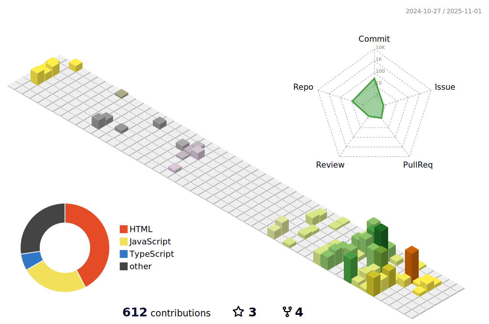

### 
Hi 👋, I'm RANJITH KUMAR VENKATACHALAM

- 🔭 I'm currently working on a full-stack Pet Clinic web application

- ❓ Ask me about anything related to MERN stack and related technologies

- ⚡ Fun fact: I'd love to change the world, but apparently, God didn't open-source it! 😁

 

 

| I can accept failure, everyone fails at something. But I can't accept not trying. - <b>Michael Jordan</b> |
| --------------------------------------------------------------------------------------------------------- |

| "Walking on water and developing software from a specification are easy if both are frozen." - <b>Edward V Berard</b> |
| --------------------------------------------------------------------------------------------------------------------- |

 

# My Daily Routine
👨‍💻 **Routine Status: Working Hard, or Hardly Working?**

### ⏰ The Morning Struggle
- Wake up: The first bug to fix today.
- Coffee: Applied. Brain function loading... 10%... 30%... coffee.exe crashed. Restarting...
- Open laptop: First battle with the keyboard warriors (aka: typos).
- Code review: Read old code. Wonder who wrote it. Realize it was me. Panic.

---

### 🧑‍💻 Debugging Time
- Start coding: Mission - make the button red.
- Button turns blue: Close laptop, walk away.
- Come back: Button is still blue. Maybe it's a feature? Convincing myself it's "creative design."
- Google: “How to make a button red in CSS?”
- Google again: “How to fix broken CSS?”
- Stack Overflow: Distance Relative.
- Bug Fixed: There is a typo. OMG

---

### 🕛 Lunch Break
- Plan: Take a 30-minute break.
- Reality: Spend an hour tweaking a single div.
- Actual break: Scroll through memes about coding. Relatable.

---

### 🕑 Afternoon Coding Sprint 💨
- Breakthrough moment: I did it! The button is red!
- Realize: Broke the entire layout. Everything is misaligned.
- Google: “How to align everything.”
- Realize again: Misread the docs for the 100th time.

---

### 🛠️ The Feature Spiral
- Add new feature: Expect to finish in 10 minutes.
- Two hours later: Feature done, but 3 new bugs are born.
- Wonder: “Is this really my job? Am I a bug breeder?”

---

### End of the Day
- Commit code: “Final fix” (it's not).
- Push to production: Site goes down.
- Revert commit: “Last time, I swear.”
- Realize: Another all-nighter ahead.
- Final thoughts: “Tomorrow will be better!” 
(It's a lie we tell ourselves every day.)

---

### ⚡Bonus Round:
- Stare at code: It stares back.
- Debugging at midnight: When the true bugs reveal themselves.
- Dreams: Full of semicolons, undefined variables, and unresolved promises.

---

### 🛌 **Sleep Status:** Still pending…  

 

## My Skill Set

<table><tr><td valign="top" width="50%">

### Frontend

</td><td valign="top" width="50%">

### Backend

</td></tr>
<tr>
<td valign="top" width="50%">

### Tools & IDE

</td>
<td valign="top" width="50%">

    
### IOT & Cloud

</td>
</tr>
</table>

## Connect with me

  

  
 

## Github Streaks

 

## Github Stats

 

 

 

 
